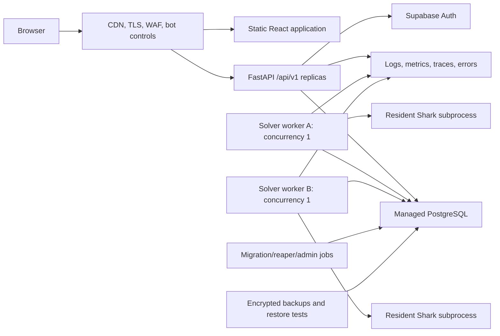

# Public MVP Launch Handout

Last updated: 2026-07-10

Status: proposed implementation plan; no production launch is authorised by this document

Repository: `C:\Users\tanay\Documents\Playground\poker-practice-tool`

## Purpose

This handout turns the existing local heads-up poker trainer into a credible, scalable public website. It is deliberately specific to the current React/FastAPI/Supabase/Shark codebase. It covers product scope, licensing, data architecture, API and worker changes, abuse controls, privacy, social safety, testing, operations, deployment, rollout, and launch gates.

The goal is not to build an enterprise platform before there are users. The goal is to remove every risk that could make a public MVP unsafe, untrustworthy, impossible to operate, or unexpectedly expensive, while preserving a path to grow.

This is an engineering plan, not legal advice. Licensing, gambling-regulation, privacy, terms, and age-policy decisions need qualified review before launch.

## Executive recommendation

Do not expose the current checkout directly to the public internet. Keep the product architecture, but replace the local-only operational foundations around it.

The recommended first public shape is:

- A controlled UK/EU-first public beta, preferably invite-based for the first cohort.
- A static React frontend delivered through a CDN/WAF.
- A same-site, versioned FastAPI API running as at least two stateless replicas.
- A paid, managed PostgreSQL database, likely the same Supabase project used for Auth.
- A separate solver-worker service. Each worker owns one resident Shark subprocess and advertises exactly one solve slot unless memory testing proves otherwise.
- A PostgreSQL-backed leased job queue. Do not add Redis or Kubernetes for the first launch unless measured load creates a real need.
- Strict server-side hand validation and replay before a solve can consume capacity.
- Server-enforced quotas, idempotency, bot protection, and a global solver kill switch.
- Curated synthetic StudySpots as the only public candidate bank at launch. User-derived spots remain private until contribution consent, provenance, validation, moderation, and deletion behaviour are finished.
- Social features behind a feature flag unless block, report, unfriend, unshare, privacy, and moderation flows are complete.
- No paid plan in the first technical launch unless pricing is essential to the business test. Entitlements and usage accounting should be designed now, but billing adds tax, refunds, webhook, and support obligations.

The work is roughly a 12-20 week full-time solo-engineer programme, plus elapsed time for licence/legal review and a measured beta. That is a planning range, not a promise. The solver licence outcome can materially change it.

## Decisions to make before implementation begins

The plan can proceed with the defaults below, but these choices should be recorded in an architecture decision record.

| Decision | Recommended MVP default | Why it matters |
| --- | --- | --- |
| Launch audience | UK/EU adults, English only | Determines legal review, privacy wording, region, support hours, and age policy. |
| Launch mode | Invite beta, then capped open beta | Protects scarce solver capacity while real queue and memory data are collected. |
| Business model | Free beta with signed-in daily solver allowance | Avoids payment scope while testing retention and unit economics. |
| Guest solver access | One bot-protected analysis trial; unlimited local preflop practice | The current guest ID is easy to reset and postflop solves are the expensive resource. |
| Social features | Feature-gated until safety controls ship | A public username graph creates abuse and moderation duties. |
| Public StudySpot sources | Curated/synthetic only | Prevents poisoning, privacy ambiguity, and deletion conflicts. |
| Availability target | 99.5% monthly beta SLO | Appropriate for an early learning product without building multi-region complexity. |
| Data region | One UK/EU region shared by API and database | Reduces latency and simplifies transfer analysis. |
| Billing | Deferred | Entitlements can exist without accepting money. |
| Mobile apps | Deferred; responsive web only | Keeps auth, release, and privacy surfaces manageable. |

Questions for the owner:

1. Is the intended launch free, paid, or freemium, and what monthly infrastructure budget is acceptable before revenue?
2. Must friends/sharing be in the first public release, or can those routes stay beta-only?
3. Are users definitely adults, and which countries should be accessible at launch?
4. Is there written permission to modify and operate Shark as a hosted service, and can its outputs be retained and shown to users?
5. What is the intended analysis allowance: per day, per week, by invite tier, or paid credits?

If unanswered, use the recommended defaults and keep each choice configurable rather than hard-coded.

## What “public MVP” means for this project

The public MVP is ready when a stranger can safely discover the site, create and recover an account, practise without poker-state contradictions, spend a clearly stated solver allowance, wait for an analysis without losing it during a deploy, review only data they are allowed to see, manage or delete their account, and get help when something fails.

The MVP does not require:

- Multi-region active-active infrastructure.
- Kubernetes.
- Unlimited analysis.
- A full payment system.
- Native mobile applications.
- Real-time sockets for every status update.
- Arbitrary stack depths, table sizes, or solver trees.
- A recommendation model or vector database.
- User-contributed public StudySpots.
- Every medium-term study idea in `docs/study-product-improvements.md`.

The MVP does require:

- Legal permission for every bundled or hosted solver/range asset.
- Durable data migrations and backups.
- Separation of HTTP and solver lifecycles.
- Explicit resource limits and abuse controls.
- Strong tenant isolation and privacy tests.
- Accurate, versioned, server-validated hand records.
- Production authentication flows.
- Operational visibility, alerts, and runbooks.
- A rollback path.
- Accessible, responsive, honest UX.

## Current-system audit

### Strong foundations worth retaining

- Poker logic is already separated into engine, settlement, visibility, preflop, and analysis modules.
- Ownership tests exist for authenticated and guest data.
- Hidden-board visibility is explicitly tested.
- The solver is behind an adapter and already uses a resident subprocess with a lock.
- Analysis work is persisted as jobs rather than held in browser memory.
- The recent queue change commits before a long solve, which is the correct direction.
- Solver outputs are version/config aware.
- StudySpot responses intentionally omit source user and database identifiers.
- The frontend has named test suites and the backend has focused pytest coverage.
- The UI is already moving toward accessible beginner language, mobile controls, active recall, and clear next actions.

### Public-launch blockers

| Severity | Finding in the current checkout | Risk | Required disposition |
| --- | --- | --- | --- |
| Stop-ship | The Shark repository has no visible top-level licence file even though its README calls it open source. The local project patches and runs it as a service. | Public source is not automatically permission to modify, redistribute, or host commercially. | Obtain an explicit licence or written permission; review its upstream solver and evaluator licences; otherwise replace Shark. |
| Stop-ship | Bundled preflop ranges have no recorded provenance or reuse terms in the repository. | The site may publicly redistribute strategy data without permission. | Document source, author, creation method, and licence for every range; replace any unverified data. |
| Stop-ship | `backend/app/db.py` uses `create_all()` and runtime `ALTER TABLE` logic. | Replicas can race; rollbacks are undefined; schema history is not auditable. | Add Alembic, a baseline migration, forward-only production migrations, and CI migration checks. |
| Stop-ship | SQLite is the production default. | Single-file locking, weak concurrent queue semantics, backup limitations, and no managed failover. | Move production and staging to PostgreSQL. Keep SQLite only for optional local convenience. |
| Stop-ship | `backend/app/main.py` starts the solver worker inside every API process. | Scaling API replicas silently multiplies multi-GB solver processes; deploys interrupt solves. | Run API and solver worker as separate process types with independent scaling and shutdown. |
| Stop-ship | The guest session header is a browser-generated bearer credential stored in local storage. | Users can mint/reset identities, bypass quotas, and steal a copied ID. | Issue opaque server-side guest sessions in secure cookies, hash secrets at rest, expire them, and apply bot/network limits. |
| Stop-ship | `HandCreate` accepts broad strings and arbitrary JSON; the backend trusts a client-authored action history and result. | Malformed or malicious hands can poison stats/StudySpots, create unsupported trees, or consume solver resources. | Add strict schemas, maximum sizes, card uniqueness checks, and a canonical server replay/validator. |
| Stop-ship | Solver quota enforcement is mainly an actor/job count and is easy to evade as a guest. | One attacker can exhaust CPU/RAM and make the site unavailable. | Add transactional usage accounting, edge rate limits, CAPTCHA/Turnstile for expensive guest actions, daily limits, and a global budget/kill switch. |
| Stop-ship | No CI, deploy manifests, containers, infrastructure code, staging environment, or rollback workflow are tracked. | Releases are manual and irreproducible. | Add CI/CD, deterministic images, environment promotion, migration jobs, and rollback/runbook documentation. |
| Stop-ship | No production privacy notice, terms, retention schedule, export/deletion flow, or breach procedure exists. | Public user data cannot be handled transparently or lawfully. | Complete legal/data work before collecting public accounts. |
| High | `get_similar_study_spots()` invokes `backfill_study_spots()` during a GET and can write after scanning 500 jobs. | Read latency and database work grow with traffic; GET is not operationally read-only. | Move extraction/backfill to worker/migration tasks. |
| High | Similarity fetches up to 300 rows and scores tag overlap in Python. | It becomes slow and memory-heavy as the bank grows. | Query indexed PostgreSQL arrays/materialized similarity keys; cap and paginate candidates. |
| High | `get_my_stats()` loads every hand and every ready solver JSON for a user. | Stats latency and API memory grow linearly with account age. | Extract decision facts and maintain daily/user aggregates. |
| High | Social list endpoints are unpaginated and some response builders perform repeated per-row lookups. | N+1 queries and unbounded responses. | Add joined/select-in queries, cursor pagination, caps, and suitable compound indexes. |
| High | Social has no unfriend, block, report, revoke-share, mute, or moderation surface. | Public abuse cannot be stopped by affected users or operators. | Build the minimum safety suite or disable social for launch. |
| High | Auth lacks password-reset UI, resend-confirmation UX, account settings, deletion/export, and explicit reauthentication for destructive actions. | Users get stranded and support burden rises. | Complete the account lifecycle. |
| High | The API returns internal solver/job error text directly. | Paths, dependency messages, or operational details can leak. | Store private diagnostics separately from stable public error codes/messages. |
| High | The current Python cache key is calculated from a payload containing `hand_id` and result/context fields. Local aggregate data showed no stored cache hits. | Cross-hand cache reuse is effectively defeated and cost scales unnecessarily. | Split tree identity from per-hand decision identity and remove ownership/incidental fields from cache keys. |
| High | No liveness/readiness distinction, worker heartbeat, queue-age alarm, or memory alarm exists. | The site can report “ok” while the database or solver is unusable. | Add component health and alerting. |
| Medium | Frontend requests have no timeout/cancellation policy and each page manages loading/polling independently. | Hanging requests, stale updates, duplicate traffic, and inconsistent error handling. | Add a central API client, AbortController timeouts, retry rules, and shared server-state management. |
| Medium | Notification polling runs every 15 seconds for each signed-in tab; analysis pages poll every 3 seconds. | Traffic grows with tabs rather than useful work. | Poll only while visible and pending, add exponential backoff/jitter/ETag, and stop immediately at terminal state. |
| Medium | Lists use fixed limits rather than cursors. | Older records become unreachable and queries degrade. | Add cursor pagination using `(created_at, id)`. |
| Medium | Public IDs are sequential integers. | Enumeration is easy even when access checks work and logs/support can confuse internal identity with public identity. | Introduce UUID/ULID public identifiers while retaining internal numeric keys if desired. |
| Medium | The project has no documented browser-security headers or same-origin production topology. | XSS impact, framing, referrer leakage, and CORS mistakes are more likely. | Add CSP, HSTS, frame restrictions, referrer policy, permissions policy, and strict production origins. |

### Measured local solver capacity

An aggregate-only inspection of the current local database found 39 non-trivial timed solves:

- Median: about 99 seconds.
- P90: about 229 seconds.
- P95: about 243 seconds.
- Maximum: about 378 seconds.
- Mean: about 124 seconds.

At the observed median, a perfectly utilised serial worker can finish only about 36 solves per hour. At P95 duration, the rate is about 15 per hour. Real capacity is lower after startup, failures, cache misses, deploys, and safety headroom. Each distinct tree can also consume multiple GB of RAM.

Therefore “free unlimited postflop analysis” is not an MVP feature. Capacity and allowance must be explicit product concepts.

## Target architecture



### Why this shape

- Static frontend traffic is cheap and globally cacheable.
- API replicas stay lightweight because they never launch Shark.
- PostgreSQL is already required and supports queue consumers with `FOR UPDATE SKIP LOCKED`; another queue service is unnecessary at MVP scale.
- Solver workers scale by measured memory slots, not by HTTP traffic.
- A worker crash does not remove a job because the database owns queue state and leases.
- A deploy can drain workers and requeue expired leases.
- Every component can begin in one region and be moved without rewriting product logic.

### Recommended initial deployment, vendor-neutral

- DNS/CDN/WAF/bot protection: a managed edge provider.
- Frontend: static hosting with immutable hashed assets and SPA fallback.
- API: managed Linux containers, two replicas, one process per container, autoscaling bounded by database connection limits.
- Database/Auth: a paid Supabase production project in the chosen UK/EU region.
- Worker: one memory-optimised Linux VM/container at first, then a second after capacity testing; one Shark process/solve at a time per slot.
- Observability: managed error tracking plus metrics/log aggregation with PII scrubbing.
- Secrets: hosting-provider secret manager, never frontend variables except Supabase publishable values.
- Email: custom SMTP with SPF, DKIM, DMARC, bounce handling, and branded templates.
- Backups: managed daily/PITR as budget requires plus periodic encrypted logical export stored in another failure domain.

Do not choose Kubernetes for the MVP. It would add cluster, networking, ingress, secret, autoscaling, and upgrade work without resolving the actual bottleneck, which is stateful high-memory solver capacity.

## Scale envelope and service objectives

### Planning envelope

Design the first production version for:

- 1,000-5,000 monthly active users.
- 100 simultaneous browser sessions during a launch burst.
- 50-250 submitted postflop analyses per day initially.
- Up to 100,000 saved hands without table redesign.
- Up to 1,000,000 extracted decision facts/StudySpots with indexed queries.
- Two API replicas and one or two solver slots.

These are capacity-test targets, not promises to users. Increase limits only after real p50/p95 solver time, memory high-water mark, arrival rate, cache effectiveness, and per-user retention are measured.

### Initial SLOs

| Surface | Beta target | Measurement |
| --- | --- | --- |
| Website availability | 99.5% monthly | Successful synthetic GET of app and API readiness. |
| API reads | p95 under 400 ms excluding analysis results | Server request histogram by route template. |
| Save hand / queue job | p95 under 750 ms | API histogram; solver time excluded. |
| Queue acknowledgement | Under 1 second | Client submit to durable queued response. |
| Analysis completion | 95% of supported jobs reach ready; queue-age objective published separately | Job transition metrics. |
| Ownership/privacy | Zero known cross-tenant disclosures | Security tests, audit, incident count. |
| Restore readiness | Restore drill succeeds quarterly; beta RPO/RTO documented | Timed staging restore. |

Do not promise a fixed solve time until the queue model is instrumented. Show an estimate range based on rolling completed jobs and current queue depth, with clear “estimate, not guarantee” language.

## Repository and module restructuring

Keep a monorepo, but establish deployable process boundaries:

```text
backend/
  alembic.ini
  migrations/
  app/
    api/v1/
    core/config.py
    core/logging.py
    core/security.py
    domain/hands/
    domain/analysis/
    domain/study/
    domain/social/
    repositories/
    main.py
    worker.py
    reaper.py
  tests/
  Dockerfile.api
  Dockerfile.worker
frontend/
  src/
    api/
    auth/
    routes/
    features/
    components/
    observability/
  Dockerfile
infra/
  README.md
  environments/staging/
  environments/production/
docs/
  architecture/
  operations/
  legal/
  public-mvp-launch-handout.md
.github/workflows/
```

This is a gradual refactor. Do not move every file before shipping value. Introduce boundaries as each workstream is implemented.

## Workstream 0: licensing, provenance, and launch authority

This workstream starts first and can block launch even if every test passes.

### Solver licence

1. Contact the Shark author and request explicit terms covering:
   - Modification of the source.
   - Building and deploying a headless worker.
   - Running it as a hosted multi-user service.
   - Commercial use if a paid tier may exist.
   - Retention and presentation of outputs.
   - Redistribution of binaries or source patches in deployment artifacts.
2. Confirm the licence of `Fossana/discounted-cfr-poker-solver`, which Shark names as its foundation.
3. Confirm the licence and notice obligations of `HenryRLee/PokerHandEvaluator` and every vendored header/library.
4. Record the exact Shark tag and full commit SHA, not only a short commit.
5. If permission cannot be obtained, stop integrating the patched worker and evaluate an alternative solver with a clear hosted-service licence.

### Range and content provenance

For every JSON range under `frontend/src/preflop/ranges` record:

- Author/creator.
- Original source or derivation method.
- Date/version.
- Licence or written permission.
- Whether modification and redistribution are allowed.
- Validation method and strategic limitations.

Create `docs/data-provenance.md` and make the range-set version visible in analysis metadata.

### Repository legal artifacts

Add, after review:

- Project `LICENSE`.
- `THIRD_PARTY_NOTICES.md`.
- Machine-readable dependency licence/SBOM generation in CI.
- Copyright/attribution in an About or Legal page where required.
- A policy that blocks dependencies with unknown or incompatible licences.

### Regulatory positioning

The current product does not accept wagers, hold player funds, settle real-money games, connect to poker operators, or provide facilities to gamble. UK Gambling Commission guidance says associated activities such as performance analytics are not generally the core gambling software it describes, but the definition is fact-specific and the Commission itself recommends legal advice when uncertain.

Obtain a written legal assessment before launch. Keep the product deliberately on the training/analytics side:

- No deposits, withdrawals, wagering, prizes, or real-money tables.
- No direct integration that automates play on a gambling site.
- No claim that the software guarantees profit.
- A clear educational/training description and solver limitation notice.
- An age policy and responsible-gambling/support wording chosen with counsel.

### Acceptance criteria

- Every solver, evaluator, range, icon, font, and third-party asset has recorded terms.
- Hosted use and modifications are clearly permitted.
- Legal review signs off launch geography, age policy, terms, privacy notice, and product positioning.
- CI produces a third-party inventory and fails on unapproved licence categories.

## Workstream 1: configuration and environment discipline

### Replace scattered environment reads

Create `backend/app/core/config.py` using a typed settings object. Load settings once during process startup and fail fast in staging/production.

Settings groups:

- `EnvironmentSettings`: environment name, release SHA, debug flag.
- `DatabaseSettings`: URL, pool size, overflow, timeouts, SSL requirement.
- `AuthSettings`: Supabase URL, issuer, audience, JWKS cache/timeout.
- `HttpSettings`: allowed origins/hosts, trusted proxies, request body maximum.
- `QueueSettings`: polling interval, lease duration, heartbeat, retry count.
- `SolverSettings`: binary path, version, full commit, memory/concurrency profile, timeout.
- `QuotaSettings`: guest/user limits and global daily budget.
- `ObservabilitySettings`: log level, DSN/export endpoints, sample rates.
- `FeatureSettings`: guest analysis, social, public StudySpots, signups, maintenance mode.

Production rules:

- `ENVIRONMENT=production` must reject SQLite.
- Production must reject wildcard CORS and localhost frontend/API URLs.
- Production must require HTTPS issuer/origins and database SSL.
- Production must reject missing release SHA, auth issuer, public URL, and solver profile.
- Do not load `.env` files in a production image. Keep the current loader for local development only.
- Never expose database, service-role, SMTP, monitoring, or solver-control secrets through `VITE_*`.

Update `.env.example` files to document every key with safe placeholders and comments. Do not put real values in examples.

### Acceptance criteria

- Each process logs a redacted config summary and release ID at startup.
- Missing/invalid production settings fail before the service accepts traffic.
- Unit tests cover environment validation and secret redaction.
- Staging and production use separate Supabase projects, databases, keys, domains, email templates, and monitoring environments.

## Workstream 2: PostgreSQL and controlled schema migrations

### Adopt Alembic

1. Add Alembic to `backend/requirements.txt`.
2. Create a baseline migration matching the current SQLAlchemy models.
3. Replace `Base.metadata.create_all()` and `_ensure_runtime_columns()` in production startup.
4. Keep a dedicated migration command/job. Do not let every API replica migrate on boot.
5. Require human review of autogenerated migrations; Alembic explicitly does not guarantee perfect autogeneration.
6. Add `alembic check` and upgrade-from-empty tests to CI.
7. Test rollback only where it is genuinely safe. Prefer forward fixes for destructive production changes.

### PostgreSQL model changes

Use internal bigint keys if convenient, but add non-sequential UUID/ULID public IDs. Prefer PostgreSQL enums or checked strings only when migration behaviour is understood.

#### `user_profiles`

Add:

- `id UUID` public/application profile ID.
- `auth_user_id UUID UNIQUE NOT NULL` mapped to Supabase `sub`.
- `username`, `username_normalized`, unique using a deliberate Unicode/case policy.
- `status`: `active`, `suspended`, `deletion_pending`, `deleted`.
- `role`: `user`, `moderator`, `admin`; admin authorisation should be data/config based and audited, not only a comma-separated environment variable.
- `terms_version`, `terms_accepted_at`.
- `privacy_version`, `privacy_acknowledged_at` if counsel requires acknowledgement.
- `created_at`, `updated_at`, `deleted_at` using timezone-aware server defaults.
- Optional preference columns or a constrained JSONB preference document.

Do not return `auth_user_id` in ordinary APIs.

#### `guest_sessions`

Add a real server-owned table:

- `id UUID`.
- `secret_hash` or HMAC digest; never store the bearer secret in plaintext.
- `created_at`, `last_seen_at`, `expires_at`, `revoked_at`.
- `analysis_trials_used` or, preferably, usage ledger linkage.
- `network_bucket_hash` for short-retention abuse enforcement, documented in the privacy notice.
- `converted_user_id` if guest data can be claimed during sign-up.

Issue a random 256-bit secret in a `Secure; HttpOnly; SameSite=Lax` cookie. Rotate on conversion/sign-in. Store only its digest. For unsafe cookie-authenticated requests, validate `Origin`/Fetch Metadata and use a CSRF token where needed.

#### `hands`

Add:

- `public_id UUID UNIQUE NOT NULL`.
- Exactly one owner: `user_id` or `guest_session_id`, enforced by a check constraint.
- `payload_version` and `engine_version`.
- `source`: `trainer`, `import`, `seed`, `admin`.
- `validation_status`, `validated_at`, and `validation_error_code`.
- `canonical_fingerprint` for duplicate/idempotency handling.
- `completed_at` separate from persistence time if needed.
- `deleted_at` for the account-deletion workflow if soft deletion is required temporarily.

Retain JSONB where it is the clearest canonical hand representation, but extract frequently queried dimensions such as branch/pot type and terminal street.

#### `analysis_jobs`

Extend or replace the current operational fields with:

- `public_id UUID`.
- `status`: `queued`, `claimed`, `solving`, `ready`, `unsupported`, `failed`, `cancelled`, `expired`.
- `priority`, `available_at`, `queued_at`.
- `claimed_at`, `lease_expires_at`, `heartbeat_at`, `worker_id`.
- `attempt_count`, `max_attempts`, `last_retry_at`.
- `progress_stage` and an intentionally coarse `progress_percent` if Shark can report it honestly.
- `cancel_requested_at`.
- `solver_profile_id`, `solver_version`, `solver_commit`, `config_hash`, `range_set_version`.
- `tree_cache_key` and `decision_cache_key`.
- `idempotency_key` scoped to actor/operation.
- `public_error_code`, `public_error_message`.
- `internal_error_class`, `internal_error_detail` with short retention and redaction.
- `finished_at`, `retention_expires_at`.

Add a unique rule preventing duplicate active jobs for the same hand/profile. Use a partial unique index in PostgreSQL.

#### `solver_cache`

Split cache identity into safe layers:

- Tree identity: solver version/commit/config, range hashes, board, stack, starting pot, branch, allowed sizes.
- Decision identity: tree identity plus canonical node path and hero combo/information required for the rendered result.

Exclude hand ID, user/guest identity, timestamps, final result, and unrelated metadata. Never reuse a cached value unless its key contains every strategic input. Add:

- `schema_version`.
- `output_checksum`.
- `created_at`, `last_accessed_at`, `hit_count`.
- `size_bytes`.
- `verified`/`quarantined_at`.
- Solver/range version columns for invalidation.

The resident C++ tree cache and durable decision-output cache are different mechanisms and should have different metrics.

#### `decision_facts`

Create a normalized, append-only derived table populated when analysis becomes ready:

- `user_id`, `hand_id`, `analysis_job_id`.
- `street`, `position`, `spot_id`, `branch_id`, `board_texture`.
- `hero_action`, `best_action`, `correct`, `mistake_class`, optional severity/EV.
- `occurred_at`.
- Solver/range profile versions.

This becomes the stats input. It avoids reparsing every historical solver JSON on each dashboard request.

#### `user_stat_daily`

Store daily aggregates by user and useful dimensions. Upsert transactionally from decision facts or rebuild via an idempotent scheduled task. The raw facts remain the source of truth.

#### `study_spots`

Add:

- `visibility`: `private`, `curated_public`, `withdrawn`.
- `provenance`: `synthetic`, `admin_curated`, `user_contributed`.
- `quality_status`: `pending`, `validated`, `rejected`.
- `range_set_version`, solver profile/version.
- `source_user_id` only in a restricted/private relationship if user contribution is ever enabled.
- PostgreSQL `text[]` tags with GIN index, or explicit dimension columns for common filters.
- A content fingerprint to deduplicate equivalent spots.
- `published_at`, `withdrawn_at`.

The public API serializer must remain incapable of returning source user/job/hand/internal IDs.

#### Usage, safety, and operations tables

Add:

- `usage_ledger`: actor, resource, units, bucket date, idempotency key, job ID, created time.
- `worker_heartbeats`: worker, release, solver profile, state, memory, current job, last heartbeat.
- `audit_events`: actor/admin action, target type/public ID, request ID, timestamp, redacted metadata.
- `blocks`, `reports`, and optionally `moderation_actions` if social is enabled.
- `account_deletion_requests` and `data_exports` for durable privacy workflows.

### Index plan

At minimum:

- `hands(user_id, created_at DESC, id DESC)`.
- `hands(guest_session_id, created_at DESC, id DESC)`.
- `analysis_jobs(status, priority DESC, available_at, queued_at, id)` for claiming.
- `analysis_jobs(user_id, created_at DESC, id DESC)`.
- Partial index on active jobs by user and by guest.
- `analysis_jobs(lease_expires_at)` where status is claimed/solving.
- `shared_hands(recipient_user_id, created_at DESC, id DESC)` and unread partial index.
- `friend_requests(recipient_user_id, status, created_at DESC)`.
- `friendships(user_a_id)` and `friendships(user_b_id)`.
- `decision_facts(user_id, occurred_at DESC)` plus dimension indexes measured from queries.
- `study_spots(street, visibility, quality_status, created_at DESC)` and GIN on tags.
- Unique cache and idempotency keys.

Validate with `EXPLAIN (ANALYZE, BUFFERS)` on production-shaped staging data rather than adding speculative indexes indefinitely.

### Database roles and tenant defence

- The browser must never receive a database/service-role credential.
- Keep normal data access through FastAPI unless a specific Supabase Data API path is deliberately designed and protected with RLS.
- Use distinct migration, API, worker, and read-only support roles.
- Revoke schema creation and broad public privileges from runtime roles.
- If Supabase-exposed tables are in an API-visible schema, enable RLS even if FastAPI is the primary access path.
- For defence in depth on direct SQLAlchemy access, evaluate transaction-scoped tenant context plus PostgreSQL policies. Never use pooled session state that can bleed between requests.
- Keep service-role keys server-only; Supabase service roles can bypass RLS.
- Enable SSL enforcement and network restrictions where hosting topology permits.

### SQLite-to-PostgreSQL migration

1. Treat the current local database as development data, not automatically production data.
2. Create a one-time exporter that validates every row into a versioned neutral format.
3. Exclude synthetic seed hands from private user libraries while preserving approved curated StudySpots.
4. Import into staging and reconcile counts, ownership, statuses, cache rows, and StudySpot anonymity.
5. Run integrity checks: duplicate cards, missing owners, orphan jobs, invalid shares, bad status transitions.
6. Decide explicitly whether any local user data has consent to move to production. Default to no.
7. Run production migrations on a fresh database and seed only versioned range/catalog data.

### Acceptance criteria

- A fresh database can reach head using one migration command.
- The prior migration can upgrade to head using representative data.
- Two workers cannot claim one job.
- Ownership/check constraints reject invalid records.
- Production startup performs no schema DDL.
- Backup restore and migration rollback/forward-fix are rehearsed in staging.

## Workstream 3: canonical hand validation and trust boundaries

### Problem

`POST /api/hands` currently accepts a completed hand authored by browser JavaScript. A public client is untrusted. Even if tampering creates no financial advantage, it can spend solver capacity, corrupt stats, and seed the global study bank.

### Versioned hand contract

Create strict Pydantic models with `extra="forbid"`:

- Enums for position, street, actor, supported action, terminal reason, and source.
- Card type validated against rank/suit syntax.
- Finite decimal/bounded numeric types for pot and amount; reject NaN/infinity.
- Exactly two distinct hole cards per player.
- Three-to-five unique board cards, with no overlap with hole cards.
- Maximum action count and maximum string lengths.
- Supported 100bb rules and known starting branches only.
- Action sequence ordering and street transition rules.
- Pot/stack contribution arithmetic within a documented rounding tolerance.
- Legal bet sizing and all-in rules.
- Result consistency with fold/showdown and the evaluator.
- Payload/body maximum at edge and application layers.

Use integer milli-big-blinds or fixed `Decimal`, not unconstrained binary floats, for new canonical arithmetic.

### Shared engine strategy

The clean long-term source of truth is a platform-neutral rules package or a backend port with cross-language fixtures.

MVP path:

1. Define a JSON fixture format containing initial state, each action, expected legal actions, pot/stacks, visible board, and final result.
2. Generate hundreds of deterministic fixtures from the current TypeScript engine.
3. Implement `backend/app/domain/hands/validator.py` that replays submitted histories.
4. Run the same fixtures against TypeScript and Python in CI.
5. Store `engine_version` with each hand.
6. Reject unsupported/mismatched histories before persistence or mark them `invalid` without allowing analysis.

Stronger later option: move common rules into a Rust/WASM package used by browser and backend. Do not make this rewrite a launch dependency if the Python validator and fixtures are trustworthy.

### Server-issued training sessions

For stronger integrity, add:

- `POST /api/v1/training-sessions` returns a public session ID, rule profile, and server random seed commitment or server-generated deal.
- Browser plays locally for responsiveness.
- Completed submission references the session and includes actions.
- Backend reconstructs the deal/state and validates it.

This is most valuable before user results contribute to public/global datasets. It may be deferred for private-only stats if canonical replay is complete.

### Idempotency

- Accept `Idempotency-Key` on hand save and analysis creation.
- Scope it to actor + operation.
- Persist request fingerprint and response public ID.
- Same key/same request returns the same result.
- Same key/different request returns `409 idempotency_conflict`.
- Frontend generates keys before submission and retains them through retry.

### Public error contract

Return a stable envelope:

```json
{
  "error": {
    "code": "hand_history_invalid",
    "message": "This hand could not be validated.",
    "request_id": "...",
    "fields": []
  }
}
```

Never return filesystem paths, SQL text, stack traces, raw worker stderr, JWT details, or full invalid payloads.

### Acceptance criteria

- Fuzz/property tests cannot create duplicate cards or illegal pot/stack transitions.
- All supported frontend branches replay identically on the backend.
- Invalid hands never enter the solver queue or public StudySpot pipeline.
- Duplicate network submissions create one hand/job.
- Logs contain request IDs but not tokens or raw hole-card/action payloads by default.

## Workstream 4: durable queue and solver service

### Split process types

`backend/app/main.py` should initialise only the API. Add:

- `backend/app/worker.py`: long-running leased queue consumer and resident solver adapter.
- `backend/app/reaper.py`: scheduled recovery for expired leases and retention tasks, or equivalent commands in a maintenance process.
- `backend/app/cli.py`: admin-safe maintenance commands.

The API image does not need the Shark binary. The worker image does.

### Atomic claim

Use a short transaction equivalent to:

```sql
WITH next_job AS (
  SELECT id
  FROM analysis_jobs
  WHERE status = 'queued'
    AND available_at <= now()
  ORDER BY priority DESC, queued_at ASC, id ASC
  FOR UPDATE SKIP LOCKED
  LIMIT 1
)
UPDATE analysis_jobs AS job
SET status = 'claimed',
    worker_id = :worker_id,
    claimed_at = now(),
    lease_expires_at = now() + :lease,
    attempt_count = attempt_count + 1
FROM next_job
WHERE job.id = next_job.id
RETURNING job.*;
```

Commit immediately. PostgreSQL documents `SKIP LOCKED` as appropriate for queue-like multiple-consumer access, not general-purpose consistent reads.

### Lease and heartbeat

- Lease duration must exceed heartbeat interval by a safe factor and account for a busy C++ solve.
- Worker emits heartbeat in a separate lightweight database session/thread/task while Shark is running.
- Reaper requeues only when lease expired and worker heartbeat is stale.
- Job attempts are bounded.
- Retry uses exponential backoff with jitter and only for classified transient errors.
- Deterministic unsupported inputs are not retried automatically.
- Worker shutdown marks itself draining, stops claiming, lets the current solve finish within deployment grace, then exits.
- If hard-killed, the lease expires and the job safely returns to the queue.

### Status transition state machine

Enforce transitions in one service and test them:

- `queued -> claimed -> solving -> ready`.
- `claimed/solving -> queued` only through lease recovery/retry.
- `queued/claimed -> cancelled` when cancellation is safe.
- `solving -> cancelled` only if the worker can terminate/reset Shark safely.
- `claimed/solving -> failed` after bounded transient attempts.
- `claimed/solving -> unsupported` for deterministic capability failures.

Record a compact job event history for operations without storing sensitive payloads in logs.

### Fair scheduling

Global FIFO allows one user to occupy the front of the queue. Implement at least:

- Maximum active queued+solving jobs per user.
- Maximum new jobs per user per day/hour.
- Guest lower priority than signed-in users.
- One simultaneously solving job per ordinary user at first.
- A fair ordering key so consecutive jobs from the same actor do not starve others.
- Reserved admin/health capacity or a global pause switch.

A practical MVP scheduler can select the oldest eligible job whose actor has no current solving job. More elaborate weighted fair queuing can wait until demand proves necessary.

### Worker resource model

- One Shark process and one solve slot per worker instance by default.
- Pin worker CPU and set a hard memory limit with enough headroom for the largest approved tree.
- Record RSS/high-water mark per job.
- Reject tree profiles predicted to exceed the worker class.
- Recycle the Shark subprocess after a configurable job count, timeout, malformed response, or memory threshold.
- Recycle the container/VM if process memory does not return after reset.
- Keep API autoscaling independent from worker autoscaling.
- Autoscale workers from oldest queued age and safe budget, never queue length alone.

### Linux worker build

The upstream CMake has Linux branches, but the current managed setup is Windows/MSYS2-specific and globally requires GUI dependencies even for the headless target.

If licensing permits:

1. Create a deterministic multi-stage Linux build pinned by full commit and checksums.
2. Split a headless CMake target so worker builds do not require FLTK/X11/image libraries.
3. Pin compiler and oneTBB versions.
4. Run version/health and golden solve tests in CI.
5. Produce an SBOM and vulnerability scan for the worker image.
6. Run as non-root with read-only root filesystem and no unnecessary network egress.
7. Copy only the worker binary/runtime libraries into the final image.
8. Compare Windows/local and Linux output tolerances on the same golden corpus.

Do not assume identical floating-point results across compilers. Define acceptable strategy-frequency/decision tolerances and record the production build fingerprint.

### Cache redesign

Current Python cache input contains per-hand fields such as `hand_id`, so equivalent strategic trees do not produce shared durable hits. Redesign with explicit canonical functions:

- `canonical_tree_spec()`.
- `tree_cache_key()`.
- `canonical_decision_spec()`.
- `decision_cache_key()`.

Test that:

- Different users and hand IDs with the same strategic inputs share the permitted cache.
- Different solver versions, settings, range hashes, boards, stack/pot, branches, or action trees never collide.
- Hidden villain cards or final outcomes do not leak through a result cached for a different information set.
- Cache corruption is detected by schema/version/checksum.
- Hit/miss/eviction metrics are accurate.

Use bounded retention/LRU. A cache is reconstructible efficiency data, not the source of truth.

### Queue UX/API

Add:

- `POST /api/v1/hands/{public_id}/analyses`.
- `GET /api/v1/analyses/{public_id}`.
- `DELETE /api/v1/analyses/{public_id}` for safe cancellation.
- `GET /api/v1/analyses?cursor=...&status=...`.

Response fields:

- Public status and timestamps.
- Queue position as an estimate, not an exact promise.
- Rolling estimate range if enough data exists.
- Solver profile and supported limitations.
- Stable retryability/error code.
- No solver input snapshot while pending unless the user genuinely needs it.

### Acceptance criteria

- API deploy/restart does not interrupt the active worker.
- Worker hard-kill causes lease recovery without duplicate ready results or double quota charge.
- Two workers safely process distinct jobs.
- Fairness tests prevent one actor monopolising solves.
- Cache effectiveness is measured and improves on a repeated-tree workload.
- A global configuration change can stop new claims within one polling interval.

## Workstream 5: quotas, abuse prevention, and cost control

### Resource policy

Define quota policy in configuration/data, not frontend constants.

Recommended beta policy:

- Preflop practice and range browsing: unlimited because they are local/static.
- Guest postflop analysis: one trial after bot challenge; short retention.
- Verified account: small daily allowance, for example three jobs/day, adjustable without deploy.
- Invite/admin tiers: explicit entitlements.
- Maximum five queued jobs is too generous if each takes minutes; begin with one solving and two total active per user.
- Global daily solve-unit ceiling and maximum oldest-queue age.

Use “solve units” rather than assuming every job costs one. A flop tree may have a higher unit weight than a river/preflop-only job after measurements exist.

### Transactional enforcement

Within one database transaction:

1. Lock the actor’s quota bucket/entitlement.
2. Validate account/guest state and global maintenance/budget flags.
3. Reserve units with an idempotency key.
4. Insert or return the analysis job.
5. Commit once.

Release or refund units only according to a documented policy:

- Unsupported because of a server capability: refund.
- Transient infrastructure failure after all retries: refund.
- Invalid input: no job should be created.
- User cancellation before claim: refund.
- User cancellation after expensive solve begins: likely no refund.

### Layered rate limiting

Apply distinct limits by endpoint and identity:

- Edge IP/network burst limits for all routes.
- Strict signup/sign-in/recovery limits configured in Supabase.
- Actor limits for hand creation, analysis creation, social requests, reports, and exports.
- Database-backed daily usage for expensive solver actions.
- CAPTCHA/Turnstile for guest analysis and suspicious signup/recovery flows.
- Global circuit breaker for solver submission.

Do not rely only on IP address. Shared networks and privacy relays exist. Do not build invasive fingerprinting. If truncated/HMAC network identifiers are retained for abuse defence, document purpose and short retention.

### Operational cost controls

- Per-day and per-month worker budget alerts.
- Maximum worker replica count.
- Queue admission closes before unbounded backlog forms.
- Automatic degraded mode: play/preflop/ranges remain available while new analysis is paused.
- Admin view of queue age, actor concentration, failure class, memory, and cost/solve.
- Alerts for sudden signup, guest-session, hand-save, or solve spikes.

### Acceptance criteria

- Resetting local storage does not reset server-side guest allowance.
- Concurrent requests cannot overspend one quota bucket.
- Edge and application limits return stable `429` responses with retry guidance.
- Solver pause does not break free local practice surfaces.
- Admin changes to allowances and kill switch are audited.

## Workstream 6: StudySpot privacy, quality, and scalable retrieval

### Separate private source from public candidate bank

At launch:

- Create private source spots from each user’s validated ready analysis for their own review.
- Search similar candidates only among `curated_public` and `validated` spots.
- Seed the public bank only through the deterministic tool/admin pipeline.
- Do not automatically publish user-derived spots.

If user contribution is later enabled:

- Obtain explicit, revocable contribution consent separate from basic service terms where appropriate.
- Explain exactly which poker data is made public/anonymised.
- Remove account/user/job/hand IDs and timestamps that could aid linkage.
- Run canonical validation, quality scoring, deduplication, and moderation.
- Define whether deletion withdraws future serving and how derived anonymous aggregates are treated.
- Keep contribution off by default until legal/product review says otherwise.

### Move all writes out of GET

- Remove `backfill_study_spots(db)` from `GET /api/study-spots/similar`.
- Extract spots in the same durable completion workflow as job finalisation, using an outbox/job if necessary.
- Add an idempotent CLI/background backfill with checkpointing and metrics.
- Run backfill during a controlled migration, not user request latency.

### Query redesign

For MVP tag overlap:

- Filter by street, visibility, quality status, compatible solver/range version, and not same content fingerprint.
- Use indexed dimensions and PostgreSQL tag-array overlap.
- Rank a bounded database result by weighted tag match, recency/diversity, and quality.
- Ensure one source hand cannot dominate results.
- Return only the requested limit with a hard maximum.
- Cache curated results briefly by source fingerprint/version.

Weighted tags should distinguish strategic meaning:

- Pot/branch and street: highest weight.
- Facing-bet/first-to-act: high.
- Board texture: medium.
- Hero/best action/verdict: medium depending on learning goal.
- Recency: low; strategic compatibility matters more.

### Product implementation

The current reveal/hide active-recall card is a good MVP direction. Complete it with:

- User selects an action before reveal where legal options are known.
- Record private practice attempt and correctness/frequency, not public identity.
- “Why this is similar” based on safe tags.
- “Report incorrect spot” for curated content.
- Solver/range version and limitation disclosure.
- No hidden/future board cards before reveal state permits them.

### Acceptance criteria

- Similar GET performs no writes.
- A private user spot is never returned to another user.
- Public responses contain no internal/source identity fields.
- Query latency remains inside target on one million representative rows.
- Removing/withdrawing a curated spot prevents it from being served immediately.

## Workstream 7: stats and recommendation scalability

### Replace full-history JSON parsing

When a job reaches ready:

1. Persist immutable solver result.
2. Extract `decision_facts` idempotently.
3. Update daily aggregates in the same transaction or publish an outbox event.
4. Mark derived-data version.

`GET /api/v1/stats/me` reads bounded aggregates and recent facts only. It must not load every historical hand and solver output.

### Backfill and correctness

- Add `derived_schema_version` to analyses/facts.
- Idempotent backfill by job/public ID range.
- Rebuild aggregate command from raw facts.
- Reconcile aggregate totals against source jobs in CI/staging.
- Exclude deleted/invalid/quarantined analyses according to policy.
- Version mistake classifiers so historical definition changes are explainable.

### Product additions suitable for MVP

- Recent activity.
- Biggest current leak with minimum sample threshold.
- Recommended next drill linked to an existing supported preflop/StudySpot mode.
- “Not enough data” instead of overconfident conclusions.
- Date window controls only after queries are indexed.

### Acceptance criteria

- Stats latency is approximately constant as a user grows from 100 to 100,000 hands.
- Reprocessing one job does not double-count.
- Deleting an account removes/reassigns facts according to the retention policy.
- Recommendations never claim statistical confidence below defined sample sizes.

## Workstream 8: authentication and account lifecycle

### Production Supabase configuration

- Separate production project and redirect allowlist.
- Custom domain if appropriate.
- Email confirmation enabled.
- Custom SMTP; built-in demonstration email limits are not suitable for launch.
- SPF, DKIM, DMARC, bounce/complaint monitoring.
- CAPTCHA/bot protection on signup, sign-in, and recovery where supported.
- Review and configure Auth rate limits before launch.
- Reasonable OTP/token expiry.
- MFA enforced for all Supabase/hosting/GitHub administrators.
- At least two trusted organisation owners for recovery.
- No service-role key in browser or logs.

### Frontend account flows

Add routes/components for:

- Create account with username availability and terms acceptance.
- Check email / resend confirmation with cooldown.
- Sign in.
- Forgot password.
- Password reset callback and set-new-password form.
- Expired/invalid link recovery.
- Session expired notice and return path.
- Account settings: username, preferences, active sessions if available.
- Export my data.
- Delete my account with reauthentication and cooling-off/confirmation policy.
- Support/contact and privacy requests.

### Profile creation

The current frontend silently retries `syncProfile()` from user metadata. Replace this with an explicit, idempotent server onboarding service:

- Verify JWT.
- Create or load profile in a transaction.
- Enforce username uniqueness at database constraint.
- Treat metadata as a requested username, not authoritative profile state.
- Return a stable onboarding state so the UI can resolve conflicts.
- Do not leave a confirmed auth account permanently unusable because profile sync failed.

### JWT verification

- Validate issuer, audience, expiry, signature algorithm, and subject.
- Cache JWKS with bounded refresh and key-rotation handling.
- Set network timeouts; a JWKS outage must not hang every request.
- Distinguish authentication failure from auth-provider availability without leaking internals.
- Test key rotation, expired tokens, wrong audience/issuer, malformed headers, and missing subject.
- Use a central dependency/middleware and typed actor context.

### Guest-to-account conversion

If retaining guest hands:

- Claim them only after successful authentication and proof of the guest cookie.
- Perform ownership change transactionally.
- Respect user quotas and deduplicate.
- Rotate/revoke guest credential.
- Explain what will be retained before sign-up.

Otherwise state clearly that guest data expires and is not migrated.

### Acceptance criteria

- Full signup-confirm-recovery-signout flows pass in Playwright against staging Auth.
- Profile outage has visible retry/recovery.
- Destructive account operations require recent authentication.
- Account deletion/export is durable, monitored, and tested.
- Auth email deliverability and rate limits are tested before announcement.

## Workstream 9: social safety or feature gating

The safest MVP option is to launch play, preflop, ranges, library, analysis, and stats first; keep social routes behind `SOCIAL_ENABLED=false` until the following exists.

### Required social features

- Remove friend.
- Block/unblock user.
- Cancel outgoing friend request.
- Revoke a shared hand.
- Report username/user/shared content with reason.
- Hide blocked users from search, requests, shares, and notifications in both directions.
- Privacy settings for who may send requests/share.
- Username change cooldown and reserved-name policy.
- Duplicate/crossed-request handling in one transaction.
- Moderation queue and audited suspend/restore actions.
- User-facing support/appeal channel.

### Data/API hardening

- Cursor-paginate requests, friends, and shares.
- Replace per-row lookups with joins/select-in loading.
- Add uniqueness/check constraints for canonical friendship pairs and active requests.
- Do not return Supabase auth user IDs. Use profile public IDs only where needed.
- Use a generic “unable to send request” outcome if username enumeration becomes an abuse vector.
- Rate-limit requests, username lookup, shares, reports, and username changes.
- Validate that shared analysis access is read-only and cannot reveal private owner-only metadata.
- Mark notifications read in a transaction scoped to recipient.

### Notification traffic

MVP polling can remain if improved:

- Poll only when signed in and document visible.
- Stop/reduce when tab is hidden or offline.
- Use 60-second baseline with jitter for notification counts.
- Use 3-second analysis polling only while a visible job is non-terminal, then exponential backoff.
- Add ETag/`If-None-Match` or `updated_at` conditional requests.
- Centralise polling so multiple components do not duplicate it.

SSE, Supabase Realtime, or WebSockets are later optimisations, not launch requirements.

### Acceptance criteria

- Block rules are enforced at database/service layer, not merely hidden in UI.
- A user can stop all further contact/share access from another user.
- Moderators can review reports without direct production database editing.
- Safety actions are audited and do not expose reporter identity.
- If any item is incomplete, social navigation and endpoints remain disabled publicly.

## Workstream 10: API architecture and performance

### Versioning and layering

- Move public endpoints under `/api/v1`.
- Keep temporary compatibility routes only with an explicit removal date.
- Route functions parse/authorise/serialize; services own business transactions; repositories own queries.
- Centralise `can_view_hand`, `can_analyze_hand`, and `can_view_analysis` policy functions.
- Use typed response DTOs that cannot accidentally include ORM-private columns.

### Pagination

Use keyset cursors, not offset, for hands, analyses, shares, requests, reports, and admin lists:

- Order by `(created_at DESC, id DESC)`.
- Opaque signed/base64 cursor contains last values and filter version.
- Default 25, hard maximum 100.
- Response contains `items` and `next_cursor`.
- Filters are validated and included in cursor integrity.

### Request behaviour

- Add request/correlation ID at edge/API and return it in errors.
- Bound request body, query length, list counts, JSON depth where possible, and processing time.
- Add server timeouts below load-balancer timeout.
- Use gzip/Brotli at edge for safe JSON/static responses.
- Cache immutable public range sets by version with ETag and long CDN TTL.
- Use `Cache-Control: no-store` for private hand/analysis/account responses.
- Set sensible database statement and lock timeouts.
- Avoid serialising full `solver_input_json` in ordinary job responses.

### Error and retry policy

- Retry only idempotent reads and explicitly idempotent writes.
- Map database uniqueness conflicts to stable `409` codes.
- Map quota to `429` with reset/retry data.
- Map maintenance/circuit breaker to `503` with safe message.
- Do not turn a worker exception into a 500 from a status GET; job error is application state.

### Acceptance criteria

- OpenAPI is generated and diffed in CI.
- Frontend types are generated or contract-tested against OpenAPI.
- All list endpoints are bounded and cursor-paginated.
- Load tests meet read/write targets with representative data.

## Workstream 11: frontend production readiness

### API client

Refactor `frontend/src/api.ts` into:

- Base request function using relative `/api/v1` in production.
- Typed error class with code, status, request ID, fields, and retry data.
- AbortController timeout.
- Auth/guest credential attachment.
- Idempotency-key support.
- One controlled 401 session-refresh/retry path where safe.
- Retry policy with exponential backoff/jitter for idempotent transient failures.
- Runtime response validation for high-risk boundaries or generated OpenAPI client.

Prefer same-site hosting/proxying so production is not dependent on broad CORS. Keep explicit CORS only for known development/staging origins.

### Server state

Adopt a small server-state library such as TanStack Query, or build an equally disciplined shared layer:

- Query keys include actor and filters.
- Cancellation on unmount/account change.
- Polling only for non-terminal jobs.
- Cache invalidation after save/share/delete.
- No stale private data after sign-out; clear actor-scoped cache.
- Offline/network retry states.

### Route and bundle behaviour

- Route-level lazy loading for analysis, ranges, social, stats, and customisation.
- Error boundary at application and route level.
- Branded 404 and maintenance pages.
- Static asset hashing and immutable cache headers.
- Source maps uploaded privately to monitoring, not exposed if policy forbids.
- Bundle-size budget in CI.

### Public pages

Add:

- Landing page explaining the precise HU 100bb training scope.
- How it works.
- Solver/range methodology and supported profile.
- Pricing/allowance page even if the beta is free.
- About/contact/support.
- Privacy, cookies/storage, terms, acceptable use, accessibility statement.
- Service status link.

Avoid SEO claims that imply real-money outcomes or guaranteed improvement.

### Queue and limitation UX

- Explain that analysis is asynchronous and may take minutes.
- Show saved/queued state immediately.
- Allow users to leave and return.
- Show supported branches/bet sizes before submission where relevant.
- Distinguish unsupported from failed and explain whether allowance was refunded.
- Show solver version/profile and approximation limitations on answer sheets.
- Do not expose operational stack traces.

### Accessibility

Target WCAG 2.2 AA across complete flows:

- Full keyboard operation and visible focus.
- No focus obscured by the mobile fixed action bar.
- Semantic buttons/links/headings and landmarks.
- Programmatic labels and error association.
- Live regions for queued/ready/errors without excessive announcements.
- Do not use colour alone for range/action/verdict meaning.
- Sufficient text and non-text contrast for every theme.
- 200% zoom/reflow and small-screen table controls.
- Reduced-motion support.
- Target sizes and spacing.
- Screen-reader card notation and poker-table reading order.
- Accessible authentication without puzzle/cognitive barriers; bot protection needs accessible alternatives.

### Browser/storage privacy

Inventory every use of local storage, cookies, scripts, and tags:

- Theme and seat preferences.
- Supabase session persistence.
- Guest credential.
- Trial counters to be removed as authority.
- Analytics/error monitoring.

Classify strictly necessary vs optional. Do not initialise optional analytics before the required consent/objection choice for the launch jurisdiction. Provide a persistent settings link.

### Acceptance criteria

- Critical flows pass automated axe checks and manual keyboard/screen-reader review.
- No private cache survives sign-out/account switch.
- Network failures and expired sessions have recoverable UX.
- Production API base is not localhost and no secret appears in the bundle.
- Lighthouse/bundle budgets are defined and tracked, but accessibility is not judged by automation alone.

## Workstream 12: privacy, retention, and user rights

### Data inventory

Create a record of processing covering:

- Supabase auth identity/email/session metadata.
- Profile/username/social graph.
- Hands, hole cards, actions, results, notes/tags if added.
- Analysis inputs/outputs, decision facts, stats.
- Guest sessions and short-lived abuse identifiers.
- Support messages and reports.
- Logs, metrics, traces, error events.
- Consent/terms acceptance.
- Backups and exports.

For each field/system record purpose, lawful basis, recipients/processors, region/transfers, access, retention, and deletion behaviour.

### Recommended initial retention policy for review

| Data | Proposed policy | Notes |
| --- | --- | --- |
| Account/profile/private hands/analysis | Until user deletion or user deletes record | Provide self-service controls. |
| Guest hands/analysis | 7-30 days | State expiry clearly; delete guest credential and private records together. |
| Queued/failed internal error detail | 30 days | Keep stable public error longer only if useful. |
| Security/access logs | 30-90 days | Redact tokens/payloads; choose based on incident need. |
| Abuse network HMAC buckets | 7-30 days | Rotate HMAC key and document purpose. |
| Audit/admin/security events | 1 year or justified period | Restrict access and avoid unnecessary payloads. |
| Curated synthetic StudySpots | Until superseded/withdrawn | No user ownership. |
| User-contributed public StudySpots | Do not enable at MVP | Requires separate policy and withdrawal mechanics. |
| Backups | Provider retention, documented | Deletion propagates when backup expires; prevent ordinary restoration from silently reviving deleted accounts. |

Counsel/privacy owner must approve actual periods. The UK GDPR does not supply one universal retention duration; purpose and necessity must drive it.

### Export

- Authenticated, recently reauthenticated request.
- Durable export job with status and expiry.
- JSON/CSV package containing account/profile, hands, analyses, stats facts, social/share records, consent history, and relevant metadata.
- Exclude other users’ private data and internal security signals.
- Encrypt at rest; deliver via short-lived signed URL or secure download endpoint.
- Audit generation/download and delete artifact quickly.

### Deletion

1. Reauthenticate and clearly describe consequences.
2. Mark account `deletion_pending`, revoke sessions, stop new jobs/social activity.
3. Cancel unclaimed jobs and define in-flight handling.
4. Remove/revoke shares and social links.
5. Delete or anonymise private hands, analyses, facts, and support data per policy.
6. Delete Supabase Auth user only after application cleanup is durable, or use a resumable saga with reconciliation.
7. Withdraw any consent-based public contribution.
8. Retain only legally/security-required minimal records, documented.
9. Track backup ageing without attempting unsafe ad hoc backup mutation.
10. Send confirmation without revealing sensitive details.

### Privacy/security incidents

- Written triage contacts and severity matrix.
- Ability to revoke keys/sessions, pause signups/social/analysis, and isolate workers.
- Preserve redacted evidence.
- Assess affected data/users and document decision.
- UK procedure capable of ICO notification within 72 hours where required and user notice without undue delay for high risk.
- Post-incident review and tracked remediation.

### Acceptance criteria

- Privacy notice matches actual systems and vendors.
- Export and deletion work end-to-end in staging, including failure/resume.
- Retention jobs are idempotent and measured.
- Optional trackers do not run before the applicable choice.
- A breach tabletop exercise is completed before open beta.

## Workstream 13: application and infrastructure security

Use OWASP ASVS 5.0 Level 2 as the verification baseline for the public application and document any inapplicable controls.

### Threat model

Create `docs/security/threat-model.md` covering at least:

- Stolen JWT or guest credential.
- Cross-tenant hand/analysis/share access.
- ID enumeration.
- Client payload tampering and JSON/resource exhaustion.
- Solver queue denial of service.
- Cache poisoning/cross-user leakage.
- StudySpot deanonymisation/poisoning.
- Username/social harassment and enumeration.
- Admin account compromise.
- Secret leakage through bundles/logs/errors/CI.
- Malicious solver output or subprocess crash.
- Dependency/supply-chain compromise.
- Backup exposure and restore of deleted data.

### HTTP and browser controls

At edge/API set and test:

- TLS only and HSTS after domains are stable.
- Content Security Policy built from actual assets; avoid broad `unsafe-inline` where possible.
- `frame-ancestors 'none'` or equivalent unless embedding is intentional.
- `X-Content-Type-Options: nosniff`.
- Strict referrer policy.
- Minimal Permissions Policy.
- Secure cookie attributes.
- Trusted-host/proxy configuration.
- No cache for private/auth responses.
- Strict production CORS allowlist; ideally same-origin API.

### Secrets and access

- Store secrets in managed secret stores.
- Separate staging/production credentials.
- Shortest practical privileges and key rotation schedule.
- MFA/hardware-backed auth for GitHub, Supabase, DNS, hosting, email, and monitoring admins.
- Branch protection and reviewed production deploys.
- Secret scanning in pre-commit/CI and repository history monitoring.
- Break-glass procedure with audited use.
- No routine direct production database edits.

### Dependency and build security

- Pin Python and Node dependencies through lock/constraints files.
- Renovate/Dependabot update PRs.
- `pip-audit`/OSV and `npm audit` or equivalent in CI with triage policy.
- Container image scanning.
- SBOM for API/frontend/worker.
- Provenance/signing for production images if supported.
- Pin GitHub Actions by full commit SHA.
- Reproducible worker source tag/commit/checksum.
- Review C++ compiler warnings and run sanitiser builds in CI on a small corpus.

### Admin operations

Build a minimal authenticated/admin-only API or CLI for:

- Queue pause/resume and global capacity.
- Requeue/cancel one job by public ID.
- View worker health and safe error class.
- Suspend profile and review report if social enabled.
- Withdraw a curated StudySpot.
- Trigger/reconcile export/deletion.

Every mutation requires reason, actor, timestamp, target, and audit event. Do not expose solver payloads or user cards in broad operational dashboards.

### Acceptance criteria

- ASVS checklist has evidence links and owners.
- External or independent security review occurs before open beta.
- No critical/high unaccepted dependency or container vulnerabilities.
- Automated cross-tenant/BOLA tests cover every object endpoint.
- Secret rotation and compromised-admin runbooks are rehearsed.

## Workstream 14: observability and operations

### Structured logs

Emit JSON logs containing:

- Timestamp, level, service, environment, release.
- Request/job/worker IDs.
- Route template, method, status, duration.
- Stable error code/class.
- Queue transition and attempt.
- Solver profile, duration, cache outcome, memory high-water mark.

Do not log:

- Authorization headers/JWTs/cookies.
- Database/SMTP/service-role secrets.
- Raw hand/solver payloads by default.
- User email.
- Full exception text if it contains paths/input; sanitise first.

### Metrics

API:

- Request rate/error/latency by route template and status class.
- In-flight requests and database pool utilisation/wait.
- Auth failure and rate-limit counts.

Queue/solver:

- Queue depth by status/priority.
- Oldest queued age.
- Claim rate and completion rate.
- Solver duration histogram by street/branch/profile/cache.
- Success/unsupported/transient/permanent failure rates.
- Lease expiries, retries, cancellations.
- Worker heartbeat and RSS/high-water memory.
- Durable and resident cache hit rate.
- Quota rejects and global units consumed.

Product/privacy/safety:

- Signup confirmation and profile completion funnel using consented/privacy-safe analytics.
- Hands saved, jobs submitted, answer sheets opened, StudySpot attempts.
- Export/deletion age and failures.
- Reports backlog if social enabled.

### Health endpoints

- `/health/live`: process event loop responds; no dependency work.
- `/health/ready`: API can reach database and required config is valid; does not launch a solve.
- `/health/version`: release/build information safe for public exposure or protected as decided.
- Worker heartbeat in database/metrics, plus worker binary health at startup.

Do not report ready merely because the FastAPI process is alive.

### Alerts

Page/urgent:

- API readiness down across replicas.
- Cross-tenant/privacy security signal.
- Database unavailable or near connection/storage limit.
- No healthy solver worker while queue open.
- Worker memory near hard limit/current job thrashing.
- Oldest queue age above published threshold.
- Job failure/lease-expiry spike.
- Backup failed.

Ticket/non-urgent:

- Cache hit rate regression.
- p95 latency or pool wait deterioration.
- Unsupported rate increase after frontend change.
- Auth email bounce/confirmation anomaly.
- Retention/export/deletion backlog.

### Runbooks

Create under `docs/operations/`:

- API outage.
- Database saturation/outage.
- Solver crash/OOM/timeout storm.
- Queue stuck/lease recovery.
- Bad migration.
- Bad release/rollback.
- Auth or email outage.
- Secret/token compromise.
- Data/privacy breach.
- Abuse/traffic spike.
- Backup restore.
- Vendor outage and user communication.

Each runbook includes detection, first safe action, diagnostics, rollback/mitigation, communication, escalation, and recovery verification.

### Acceptance criteria

- A synthetic request traces edge/API/database and a test job traces queue/worker/solver.
- Alerts fire in staging fault injection.
- Operators can diagnose queue age and worker capacity without reading user data.
- A restore drill and solver-worker kill drill are documented and timed.

## Workstream 15: backups, recovery, and data durability

### Backup design

- Use a paid database tier with managed daily backups; enable PITR when RPO/cost justifies it.
- Keep periodic encrypted logical dumps in a separate provider/account/failure domain.
- Back up migration history, range catalogue, feature configuration, and infrastructure definitions.
- Database backups do not automatically imply object/export artifact backups; define each store separately.
- Encrypt in transit/at rest and tightly limit restore/download permission.

### Recovery objectives

Set explicit beta values after cost review, for example:

- RPO: 24 hours with daily backups, improved if PITR is purchased.
- RTO: 4-8 hours for beta, proven by exercise.

Do not advertise stronger objectives than tested.

### Restore procedure

1. Restore to isolated staging project/database.
2. Apply/verify expected migration revision.
3. Reset custom role credentials because backup behaviour may exclude them.
4. Run integrity/reconciliation queries.
5. Confirm deleted/suspended account handling and current auth compatibility.
6. Smoke test private ownership, queue claim, and one known solver result.
7. Record actual restore time and gaps.

### Acceptance criteria

- Backups are monitored, not merely configured.
- A non-author performs or observes a successful restore before launch.
- Restore credentials and steps are available during a primary operator outage.
- RPO/RTO and backup deletion propagation are stated in internal policy.

## Workstream 16: CI/CD and environments

### Branch and review policy

- Protect the production branch.
- Require CI and review for migration, auth, ownership, solver, and infrastructure changes.
- Keep current direct-checkout workflow during development, but production releases must be immutable and traceable.
- Tag releases and record release SHA in every service.

### Pull-request CI

Backend:

- Formatting/linting, for example Ruff.
- Type checking, introduced incrementally.
- Pytest unit and API tests.
- PostgreSQL integration tests using a service container.
- Alembic upgrade from empty and prior snapshot.
- `alembic check`.
- Dependency/licence/security scan.

Frontend:

- Formatting/linting.
- TypeScript build.
- Replace ad hoc executable test scripts over time with Vitest plus React Testing Library while retaining deterministic engine tests.
- Component/page tests.
- Accessibility smoke checks.
- Production build and bundle budget.
- Dependency/licence/security scan.

Worker:

- Source patch applicability at pinned commit.
- Linux build.
- Version/health protocol test.
- Golden solver corpus with tolerances.
- Timeout/restart/malformed response tests.
- Sanitiser build on small corpus.
- Image scan/SBOM.

End-to-end:

- Playwright against disposable frontend/API/PostgreSQL.
- Auth can use a dedicated staging/test project or controlled test identities; never production.
- Save -> queue with fake solver -> ready -> answer sheet.
- Ownership/share/block/export/delete critical paths.

### Deployment pipeline

1. Build once and attach immutable release SHA.
2. Scan/test artifacts.
3. Deploy to staging.
4. Run migrations as one controlled job.
5. Run smoke/E2E/migration verification.
6. Human approval for production during beta.
7. Apply backward-compatible migration.
8. Deploy API, then workers with drain policy, then frontend.
9. Run synthetic checks.
10. Observe metrics/error budget.
11. Roll back application artifacts if needed; use forward database fix unless a tested safe downgrade exists.

Use expand/migrate/contract for destructive schema changes:

- Expand: add nullable/new structure.
- Deploy dual-compatible code.
- Backfill and verify.
- Switch reads/writes.
- Contract in a later release.

### Environments

Local:

- SQLite optional for quick unit work.
- Docker Compose PostgreSQL for production-like development.
- Fake solver default; real local Shark opt-in.

Staging:

- Separate Supabase project, database, Auth users, SMTP sandbox, secrets, monitoring.
- Small real solver worker for golden/smoke/capacity tests.
- Synthetic data only.

Production:

- No test users/data copied from staging.
- Restricted admin access.
- Real email/domain/monitoring/backups.
- Feature flags default conservative.

### Acceptance criteria

- Any production artifact maps to commit, dependency inventory, migration revision, and test run.
- Staging and production secrets/data cannot cross accidentally.
- Rollback and worker drain are tested.
- A failed migration prevents application promotion.

## Workstream 17: testing strategy

### Unit and property tests

- Card parsing/uniqueness.
- Hand evaluator and settlement.
- Legal action generation and replay invariants.
- Visibility at every history point.
- Preflop range probabilities and deterministic sampling with seed.
- Quota ledger/idempotency.
- Queue state machine and retry classification.
- Cache key inclusion/exclusion properties.
- StudySpot anonymisation serializer allowlist.
- Stats fact extraction/aggregation idempotency.

Use property-based tests for card/action/state invariants where valuable.

### PostgreSQL integration tests

- Concurrent job claim with two sessions.
- Lease expiry/recovery and retry cap.
- Partial unique indexes for active jobs/requests.
- Quota race with concurrent submissions.
- Cursor pagination stability with equal timestamps/concurrent insert.
- RLS/role policy if adopted.
- Migration with production-like data volume.
- JSONB/tag-array query plans.

SQLite tests cannot establish PostgreSQL locking correctness.

### Authorisation matrix

For every endpoint/object state test:

- Anonymous without guest session.
- Valid guest owner.
- Different guest.
- Authenticated owner.
- Different authenticated user.
- Accepted share recipient.
- Friend without share.
- Blocked user.
- Moderator/admin where applicable.
- Suspended/deletion-pending actor.

Test both successful and indistinguishable 404/403 behaviour to avoid enumeration.

### Contract tests

- OpenAPI snapshot/diff.
- Generated frontend types compile.
- Every status/error code is handled.
- Old frontend with new additive backend during rolling deploy.
- New frontend with old backend only if deployment order allows it.

### Solver verification

- Version/commit mismatch.
- Known supported branch corpus.
- Known unsupported corpus.
- Golden strategy/action outputs within tolerances.
- Memory/time measurement by branch/street.
- Subprocess malformed JSON, early exit, hang, stderr flood, OOM kill.
- Cancel/drain/restart.
- Cache hit correctness and isolation.
- Cross-platform build comparison.

### End-to-end tests

- Guest practice and one analysis trial.
- Account signup/confirmation/onboarding.
- Sign in/recovery/sign out.
- Play a full hand, save idempotently, queue, leave page, return to ready result.
- Unsupported/refunded and failed/retry states.
- Private library pagination and search/filter.
- StudySpot decide/reveal without future-card leak.
- Share/revoke/block if social enabled.
- Export/delete account.
- Keyboard-only/mobile viewport critical flows.

### Performance and resilience tests

Use staged load, never production user data:

- API browse/list/status traffic at 2x expected launch burst.
- Concurrent save/queue with quota contention.
- 100k hands/user and one million decision/StudySpot rows.
- Polling traffic from many visible/hidden tabs.
- Database pool exhaustion and slow query fault.
- Worker absent, worker slow, worker killed, queue admission paused.
- WAF/rate-limit behaviour.

Solver capacity test must report:

- Branch/street/config.
- p50/p90/p95 duration.
- RSS peak and post-job residual.
- Failure/unsupported rates.
- Cold/warm resident and durable cache behaviour.
- Safe jobs/hour per worker class with at least 30% headroom.

### Acceptance criteria

- Critical business and privacy paths have automated coverage.
- Production-like PostgreSQL concurrency tests pass repeatedly.
- Load test meets SLO at 2x planned beta burst without solver oversubscription.
- Independent/manual accessibility and security checks are completed.

## Workstream 18: product features required before public MVP

### Required launch surfaces

1. Public landing and methodology pages.
2. Complete auth/account lifecycle.
3. Guest and signed-in practice with clear allowances.
4. Hand library with pagination, filters, delete, and useful empty/error states.
5. Durable analysis queue status, cancel/retry/refund semantics, and limitation disclosure.
6. Answer sheet with visibility correctness and solver/range version.
7. Range charts with provenance/version.
8. Stats with sample-size honesty.
9. Account settings/export/delete.
10. Privacy/terms/cookies/storage/accessibility/support/status.
11. Admin/operations ability to pause solver and handle users/jobs safely.
12. Social safety suite only if social is enabled.

### Highly valuable but can follow beta

- Interactive StudySpot action selection and spaced repetition.
- Hand notes/tags/review-later.
- Post-session summary.
- Replay timeline.
- Account-backed theme/seat preferences.
- Email notification when a long analysis is ready, with opt-in/preferences and no hand data in email.
- More supported branches/bet sizes after solver capacity/correctness testing.
- Paid entitlements and subscriptions.

### Explicit non-goals for launch

- Real-money integration or hand automation on poker sites.
- User-uploaded executable/range/solver plugins.
- Arbitrary user solver configuration.
- Public profiles/feed/chat.
- Leaderboards that incentivise fake hands.
- Claims of guaranteed winnings.

## Workstream 19: support, moderation, and business operations

Even a small beta needs ownership beyond code.

### Support

- `support@` address or ticket system monitored on a stated schedule.
- Support ID/request ID visible in errors.
- Templates for auth email, queue delay, unsupported hand, quota, deletion/export, and outage issues.
- Never ask users to send JWTs, passwords, full database dumps, or unnecessary private hand data.
- Document identity verification for privacy requests.

### Public communication

- Status page separate from primary infrastructure.
- Changelog/release notes for strategy-affecting solver/range changes.
- In-product maintenance/analysis-paused banner.
- Plain-language incident/outage communication process.
- Methodology version history so old answer sheets remain interpretable.

### Moderation

If social is enabled:

- Written acceptable-use/content policy.
- Report categories and severity/SLA.
- Moderator access controls and training.
- Evidence retention/redaction rules.
- Appeals/contact route.
- Emergency suspend and block propagation.

### Acceptance criteria

- A user can obtain help without contacting the developer personally.
- Operators can communicate an analysis outage while play remains live.
- Support/moderation never requires sharing broad production credentials.

## Phased implementation programme

### Phase 0: decisions and stop-ship clearance — 1-2 engineering weeks plus external review

Deliverables:

- Answer product/geography/budget/social/billing questions.
- Solver/upstream/range licence clearance or replacement decision.
- Architecture decision records for Postgres queue, deployment region/provider, guest policy, StudySpot provenance.
- Data inventory and draft retention policy.
- Threat model v1.
- Feature flags defaulting solver submissions/social/user contributions off.

Exit gate:

- No unresolved licence path for the intended public service.
- The operator accepts expected solver capacity/cost and launch scope.

### Phase 1: engineering foundation — 2-3 weeks

Deliverables:

- Typed settings and production validation.
- Dockerised API and local Postgres Compose environment.
- Alembic baseline and migration CI.
- PostgreSQL-compatible models/indexes/public IDs.
- Structured errors/request IDs/log redaction.
- Basic GitHub Actions for current suites/build/scans.

Exit gate:

- Fresh and upgrade migrations pass; API works against Postgres; no runtime DDL.

### Phase 2: trust boundary and quotas — 2-4 weeks

Deliverables:

- Strict hand schemas and server replay validator.
- Cross-language fixture corpus.
- Server-issued guest sessions.
- Idempotent save/analyse.
- Usage ledger, daily/global quotas, bot challenge, rate limits.
- Central ownership policy and full endpoint matrix tests.

Exit gate:

- Invalid/tampered hands cannot be solved or published; concurrent quota bypass tests fail safely.

### Phase 3: worker/queue productionisation — 3-5 weeks

Deliverables:

- Separate worker/reaper process.
- Atomic Postgres leased queue, heartbeat, retries, drain/cancel.
- Linux deterministic worker build and licence notices, or replacement solver adapter.
- Cache-key redesign and metrics.
- Worker memory/capacity benchmark.
- Queue UX and global pause/degraded mode.

Exit gate:

- API/worker deploy and failure drills do not lose/duplicate jobs; safe jobs/hour is known.

### Phase 4: scalable product/data flows — 2-4 weeks

Deliverables:

- Decision facts/daily aggregates and backfill.
- StudySpot writes removed from GET; curated bank/queries.
- Cursor pagination and query optimisation.
- Account lifecycle/export/delete.
- Required landing/methodology/legal/support pages.
- Frontend API/server-state/error/accessibility improvements.
- Social safety or confirmed feature gate.

Exit gate:

- Critical user journey works on production-shaped staging data and meets latency targets.

### Phase 5: infrastructure, observability, and verification — 2-4 weeks

Deliverables:

- Separate staging/production infrastructure and secrets.
- CDN/WAF/TLS/security headers.
- SMTP/Auth production configuration.
- Metrics, dashboards, alerts, status page, runbooks.
- Managed/offsite backups and restore drill.
- Playwright, load/resilience tests, ASVS evidence, accessibility review, independent security review.

Exit gate:

- All P0 launch gates below pass with evidence.

### Phase 6: controlled rollout — at least 2 measured weeks

Stages:

1. Internal synthetic traffic.
2. 10-25 trusted alpha users.
3. 100-250 invite beta users.
4. Capped open beta.
5. Public MVP announcement only after capacity/error/privacy/support data is acceptable.

At every stage record queue arrival/completion, solve duration/RSS, failure causes, auth email deliverability, retention, support load, and abuse.

Rollback criteria:

- Any cross-user disclosure or credible privacy incident.
- Repeated solver OOM affecting host/API/database.
- Queue oldest age beyond stated ceiling without admission control.
- Unbounded cost/abuse.
- Data corruption or untested migration failure.
- Auth email/account recovery unusable.

Rollback means pause new analysis/signups/social as appropriate, preserve play/preflop/ranges where safe, and communicate status. It does not mean deleting evidence or resetting production data.

## Prioritised implementation backlog

### P0 — must complete before any public beta

- P0-01 Shark/upstream/evaluator/range licensing and provenance.
- P0-02 Production scope, geography, age, quota, budget, social decision.
- P0-03 Alembic and PostgreSQL migration.
- P0-04 Separate API and leased solver worker.
- P0-05 Strict hand validation/replay.
- P0-06 Server-owned guest sessions.
- P0-07 Transactional quota, global circuit breaker, edge bot/rate controls.
- P0-08 Central ownership policies and object-level authorisation tests.
- P0-09 StudySpot curated/private separation and removal of writes from GET.
- P0-10 Production Auth/email/recovery/account deletion/export.
- P0-11 CI/CD, staging, immutable containers, migration workflow.
- P0-12 Logs/metrics/alerts/health/runbooks.
- P0-13 Privacy/terms/retention/cookie-storage/breach work.
- P0-14 Backups and successful restore test.
- P0-15 Accessibility/security/load review.
- P0-16 Social disabled or safety-complete.

### P1 — should complete before open beta

- P1-01 Decision-fact stats and aggregates.
- P1-02 Cursor pagination for all growing lists.
- P1-03 Cache identity redesign and eviction.
- P1-04 Queue estimate/cancel/refund UX.
- P1-05 Public methodology/version history.
- P1-06 Admin queue/report/deletion operations.
- P1-07 Central frontend server-state/polling/error system.
- P1-08 Curated StudySpot reporting/quality workflow.
- P1-09 Support/status/changelog process.

### P2 — post-MVP growth

- Paid subscriptions/credits.
- Email-ready notifications.
- More worker regions/classes.
- Read replicas/search service only when measured.
- Realtime notifications.
- User-contributed StudySpots with consent.
- Advanced study sessions/spaced repetition/replay/notes.
- Native apps.

## Launch gate checklist

### Legal and product

- [ ] Hosted solver use and modifications are licensed in writing.
- [ ] Upstream/evaluator/range/content provenance is complete.
- [ ] Legal review covers training positioning, age/geography, privacy, terms, and disclaimers.
- [ ] Public scope and non-goals are documented.
- [ ] Quota and refund policy is visible to users.
- [ ] Social is safety-complete or disabled.

### Data and security

- [ ] Production uses managed PostgreSQL and Alembic at expected revision.
- [ ] Browser has no service/database secrets.
- [ ] Server validates every hand before analysis.
- [ ] Ownership matrix passes for every object endpoint.
- [ ] Guest credentials are server-issued, secure, expiring, and quota-bound.
- [ ] Rate limits/bot protection/global circuit breaker work.
- [ ] StudySpot public API cannot serve private/user-derived candidates.
- [ ] Security headers/CORS/CSRF/session controls are verified.
- [ ] ASVS evidence and independent review have no unaccepted high finding.

### Reliability and scale

- [ ] API and worker deploy independently.
- [ ] Queue claim/lease/retry/cancel/drain tests pass under concurrency.
- [ ] Worker p50/p95/RSS and safe capacity are measured on production class.
- [ ] Admission closes before backlog/cost becomes unsafe.
- [ ] API/list/stats/StudySpot load tests meet SLO on representative data.
- [ ] Backups are current and isolated restore succeeds.
- [ ] API/database/worker alerts and status communication are tested.

### User experience

- [ ] Signup, confirmation, recovery, signout, deletion, and export work.
- [ ] Guest limit and conversion/expiry are explained.
- [ ] Queued work survives navigation/deploy and has honest status.
- [ ] Unsupported/failed/cancelled/refunded states are understandable.
- [ ] Solver/range version and supported-tree limitations are visible.
- [ ] No hidden/future card leaks in play, history, sharing, or StudySpots.
- [ ] Critical flows pass WCAG 2.2 AA review across responsive layouts.
- [ ] Privacy/terms/storage/accessibility/support/status links are present.

### Operations

- [ ] Two administrators have MFA and recovery access.
- [ ] Secrets can be rotated without source changes.
- [ ] Release rollback and bad-migration runbooks are rehearsed.
- [ ] Solver pause/degraded-mode banner is tested.
- [ ] Support inbox/process and response templates exist.
- [ ] Privacy incident tabletop and 72-hour assessment process are complete.
- [ ] Release owner explicitly signs the go/no-go record.

## Suggested first ten implementation tickets

These are the highest-leverage engineering sequence after licence/product decisions begin in parallel.

1. Add typed production settings and fail-fast validation.
2. Add Docker Compose PostgreSQL, psycopg driver, Alembic baseline, and migration CI.
3. Add UUID public IDs, owner constraints, queue lease fields, and indexes.
4. Extract `worker.py`; make API startup solver-free; implement atomic claim/heartbeat/reaper using a fake solver first.
5. Define versioned strict hand schemas and build cross-language replay fixtures.
6. Implement server guest sessions, idempotency, usage ledger, and global analysis pause.
7. Centralise ownership policies and create the full authorisation test matrix.
8. Remove StudySpot backfill from GET; add private/curated visibility and indexed retrieval.
9. Add structured errors/logs/metrics and liveness/readiness/worker health.
10. Stand up isolated staging with CI deploy, then run queue kill, migration, and restore drills.

Do not begin by redesigning the visual interface, adding billing, or adding more solver trees. The current bottlenecks are trust, durable operation, capacity, and launch authority.

## Proposed API v1 surface

This is a target outline, not an instruction to preserve every existing response shape.

### Session/account

- `POST /api/v1/guest-sessions`
- `GET /api/v1/me`
- `PATCH /api/v1/me/profile`
- `GET /api/v1/me/preferences`
- `PUT /api/v1/me/preferences`
- `POST /api/v1/me/export`
- `GET /api/v1/me/exports/{id}`
- `POST /api/v1/me/deletion-request`
- `DELETE /api/v1/me/deletion-request` during any cooling-off window

Supabase continues to own password/session endpoints; frontend adds correct provider flows.

### Hands and analyses

- `POST /api/v1/hands`
- `GET /api/v1/hands?cursor=&limit=&tag=&status=`
- `GET /api/v1/hands/{hand_id}`
- `DELETE /api/v1/hands/{hand_id}`
- `POST /api/v1/hands/{hand_id}/analyses`
- `GET /api/v1/analyses?cursor=&status=`
- `GET /api/v1/analyses/{analysis_id}`
- `DELETE /api/v1/analyses/{analysis_id}`

### Study and ranges

- `GET /api/v1/range-sets`
- `GET /api/v1/range-sets/{version}`
- `GET /api/v1/study-spots/similar?...`
- `POST /api/v1/study-attempts`
- `POST /api/v1/study-spots/{id}/reports` for curated public IDs if exposed

### Stats/social

- `GET /api/v1/stats/me?window=30d`
- Social endpoints only when enabled; all lists cursor-paginated and all user references public profile IDs.

### Operations

- Public: `/health/live`, `/health/ready`.
- Protected admin: queue pause/capacity, job action, worker status, reports, curation, export/deletion reconciliation.

## Proposed production environment variables

Names may change, but ownership and validation should not.

```text
ENVIRONMENT
RELEASE_SHA
PUBLIC_APP_URL
DATABASE_URL
DATABASE_POOL_SIZE
DATABASE_MAX_OVERFLOW
DATABASE_CONNECT_TIMEOUT_SECONDS
DATABASE_STATEMENT_TIMEOUT_MS
SUPABASE_PROJECT_URL
SUPABASE_JWT_AUDIENCE
ALLOWED_ORIGINS
ALLOWED_HOSTS
TRUSTED_PROXY_COUNT
MAX_REQUEST_BODY_BYTES
GUEST_SESSION_HMAC_KEY
ABUSE_NETWORK_HMAC_KEY
QUEUE_POLL_SECONDS
QUEUE_LEASE_SECONDS
QUEUE_HEARTBEAT_SECONDS
QUEUE_MAX_ATTEMPTS
ANALYSIS_SUBMISSIONS_ENABLED
ANALYSIS_GLOBAL_DAILY_UNITS
ANALYSIS_USER_DAILY_UNITS
ANALYSIS_GUEST_TRIAL_UNITS
SOCIAL_ENABLED
PUBLIC_STUDY_SPOTS_ENABLED
SHARK_WORKER_PATH
SHARK_VERSION
SHARK_COMMIT_FULL
SHARK_PROFILE_ID
SHARK_TIMEOUT_SECONDS
SHARK_THREAD_COUNT
SHARK_MEMORY_LIMIT_MB
LOG_LEVEL
ERROR_MONITORING_DSN
OTEL_EXPORTER_OTLP_ENDPOINT
```

Sensitive values belong in secret management. Feature/allowance settings that need live changes may move to an audited database/config service rather than environment variables.

## Risk register

| Risk | Likelihood before controls | Impact | Mitigation/trigger |
| --- | --- | --- | --- |
| Shark hosted-use terms unavailable | High/unknown | Launch-blocking | Resolve first; maintain replacement path. |
| Solver memory OOM | High | Worker/host outage, lost capacity | One slot, hard limits, benchmarks, profile rejection, recycle, separate host. |
| Free-tier abuse | High | Cost/outage | Server quota, bot controls, admission, kill switch, invite rollout. |
| Cross-tenant disclosure | Medium | Critical privacy/trust harm | Central policies, UUIDs, serializer allowlists, matrix tests, review. |
| Bad client hand corrupts data | High | Wrong feedback/cost/bank poisoning | Strict schema/replay/server sessions. |
| Queue job stranded during deploy | High in current design | Poor UX/data inconsistency | Leases, heartbeat, separate worker, drain/reaper. |
| Cache leaks/corrupts strategy | Medium | Wrong/private answer | Canonical keys, version/checksum, isolation corpus, quarantine. |
| Public StudySpot poisoning/linkage | High in current auto-global flow | Trust/privacy harm | Curated-only bank, consent/quality before user publication. |
| Database migration damages data | Medium | Outage/loss | Alembic, staging volume tests, expand/contract, backup/restore. |
| Auth email failure at launch | Medium/high without custom SMTP | Signup outage/support spike | Custom SMTP, DNS, limits, sandbox and launch test. |
| Social abuse | High if public | User safety/reputation | Ship safety suite or disable social. |
| Stats become slow | High with account age | UX/API load | Decision facts/aggregates/indexes. |
| Vendor outage | Medium | Partial/full outage | Degraded mode, status/runbook, avoid coupled worker/API. |
| Operator account compromise | Medium | Critical | MFA, least privilege, multiple owners, audit, key rotation. |
| Privacy request failure | Medium | Legal/trust harm | Durable export/deletion workflow and reconciliation. |

## Official guidance used

The following primary/authoritative sources informed this handout. Re-check them during implementation because services and law change.

- [Supabase production checklist](https://supabase.com/docs/guides/deployment/going-into-prod): RLS review, SSL/network controls, MFA, custom SMTP, Auth/CAPTCHA limits, load testing, backups, and production deployment.
- [Supabase database connections](https://supabase.com/docs/guides/database/connecting-to-postgres): direct/session/transaction pooling choices and connection-budget considerations.
- [Supabase database backups](https://supabase.com/docs/guides/platform/backups): daily backup/PITR behaviour, restore impact, and logical dump options.
- [FastAPI deployment guidance](https://fastapi.tiangolo.com/deployment/) and [FastAPI containers](https://fastapi.tiangolo.com/deployment/docker/): HTTPS, startup, restart, replication, memory, and one-process-per-container deployment concerns.
- [Alembic autogenerate documentation](https://alembic.sqlalchemy.org/en/latest/autogenerate.html): reviewed migration generation and `alembic check`.
- [PostgreSQL locking clause](https://www.postgresql.org/docs/current/sql-select.html): `FOR UPDATE SKIP LOCKED` queue-like consumer semantics.
- [OWASP ASVS](https://owasp.org/www-project-application-security-verification-standard/): application security verification baseline.
- [OWASP REST Security Cheat Sheet](https://cheatsheetseries.owasp.org/cheatsheets/REST_Security_Cheat_Sheet.html): strong types, input validation, and safe logging guidance.
- [W3C WCAG 2.2](https://www.w3.org/TR/WCAG22/): target accessibility requirements.
- [ICO data protection by design and default](https://ico.org.uk/for-organisations/uk-gdpr-guidance-and-resources/accountability-and-governance/guide-to-accountability-and-governance/data-protection-by-design-and-by-default/) and [data protection principles](https://ico.org.uk/for-organisations/uk-gdpr-guidance-and-resources/data-protection-principles/a-guide-to-the-data-protection-principles/): minimisation, purpose, and storage limitation.
- [ICO storage/access technology guidance](https://ico.org.uk/for-organisations/direct-marketing-and-privacy-and-electronic-communications/guidance-on-the-use-of-storage-and-access-technologies/what-are-storage-and-access-technologies/): cookies, web storage, scripts/tags, consent, and exceptions.
- [ICO personal-data breach guide](https://ico.org.uk/for-organisations/report-a-breach/personal-data-breach/personal-data-breaches-a-guide/): detection, records, risk assessment, and 72-hour notification where required.
- [UK Gambling Commission: what is gambling software?](https://www.gamblingcommission.gov.uk/licensees-and-businesses/guide/what-is-gambling-software): distinction between gambling software and associated activities such as performance analytics, with explicit advice to obtain legal guidance when uncertain.
- [Shark 2.0 repository](https://github.com/24parida/shark-2.0): upstream project description, releases, performance constraints, and dependencies. Its apparent absence of a top-level licence is why explicit permission is a stop-ship item.

## Final recommendation

The existing poker product does not need to be thrown away. The frontend engine, analysis UX, preflop content structure, solver adapter, and ownership intent are a viable product core.

The public-MVP transformation is primarily about making scarce solver work durable and governable, making client-authored poker data trustworthy, making privacy/ownership enforceable at scale, and making the service operable when the original developer is not watching the terminal.

The critical path is:

1. Clear licences and launch scope.
2. Move to migrations/PostgreSQL.
3. Validate hands and enforce durable identity/quotas.
4. Split the solver into a leased, measured worker service.
5. Keep the public study bank curated and social gated.
6. Complete account/privacy/accessibility/operations.
7. Prove it through staging, restore, kill, security, and capacity tests.
8. Roll out gradually and let measured demand—not imagined scale—decide the next layer.
